
<a  target="_blank" rel="noopener noreferrer">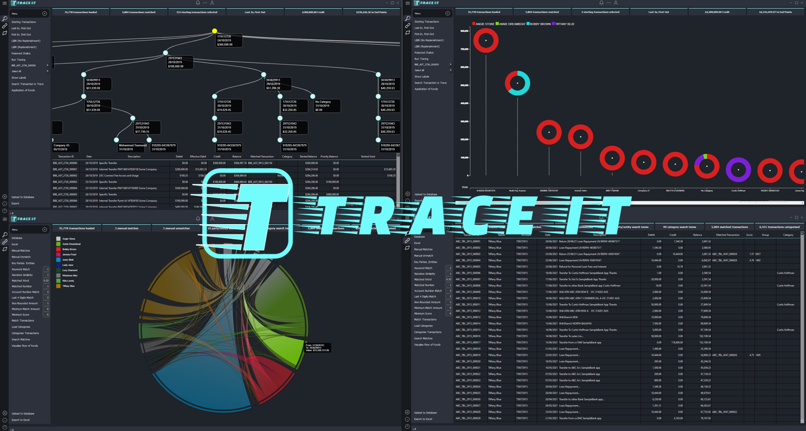</a>

## **What is TraceIt?**

TraceIt is an automated asset tracing solution that allows investigators to effortlessly track and analyse complex financial transactions with exceptional speed and accuracy. This technology enables the swift identification of transaction origins and ultimate usage, transforming the investigative process.

At its core, TraceIt contains a transaction matching engine that rapidly scans and scores potential matches between debits and credits, selecting the most likely matches. Investigators can refine the scoring parameters and matching criteria to optimise results, leveraging their expertise to fine-tune the automated process. Additionally, TraceIt categorises unmatched transactions based on a customisable reference table, ensuring a comprehensive understanding of the transaction population.

With TraceIt, investigators can efficiently review and refine automated matches, quickly identifying and overriding false positives. The simple interface enables seamless searching, filtering, and manual matching, allowing investigators to quicky craft an accurate picture of the flow of funds.

The culmination of TraceIt's Transaction Matching Platform is a stunning interactive chord diagram, providing a holistic visualization of fund flows within the bank statement population. 

With TraceIt, investigators can seamlessly trace the journey of funds through bank accounts, and uncover the ultimate destination of funds. By inputting a set of starting transactions, investigators can leverage four automated tracing methodologies:
* **Last-In, First-Out (LIFO):** Funds are paid out by the most recently deposited funds
* **First-In, First-Out (FIFO):** Funds are paid out in the order which they were received
* **Lowest Intermediate Balance Rule (LIBR):** Debtors spend their own money from a comingled account before spending the creditor's funds
* **Poisoned Chalice:** When tainted funds are credited to a bank account, the entire balance of the account is then considered tainted. 

The tracing engine rapidly processes hundreds of transactions in mere minutes, providing a comprehensive visualisation of the entire transaction path. Investigators can interactively explore the trace by:
* Clicking through transactional data in a intuitive, step-by-step manner
* Navigating an interactive tree diagram, providing a clear overview of the transactional hierarchy

TraceIt also enables investigators to filter traces and focus on specific destinations, revealing:
* Total amounts transferred to designated destinations
* Parties or entities responsible for payments, providing valuable insights into financial networks

With TraceIt's tracing capabilities, investigators can efficiently uncover the flow of funds, identifying key connections and relationships that may have otherwise gone unnoticed.

## **Transaction Matching & Categorisation** 

Before tracing can begin, TraceIt identifies and matches debits and credits within the population. This process involves:
1. **Identifying Possible Matches:** TraceIt finds potential credit matches for each debit transaction, considering amount, timing (within 1 business day), and account differences.
1. **Scoring Possible Matches:** TraceIt evaluates each possible match using 6 factors (listed below) and assigns a score. Users can adjust the weights of these factors to customize the scoring process.

**Scoring Factors:**
1. **Overall Narrative Similarity Score** (default weight = 1): Measures the similarity between transaction narratives using Levenshtein Distance Computation.
1. **Keyword Match** (default weight = 1): Identifies search terms from the user's reference table in transaction narratives.
1. **Matched Word** (default weight = 0.33 per word): Finds common words between transaction narratives.
1. **Matched Number** (default weight = 1 per number): Detects common numbers between transaction narratives.
1. **Account Number Match** (default weight = 3 for full account number, 2 for last 4 digits): Identifies matching account numbers in transaction descriptions.
1. **Non-Rounded Amount** (default weight = 1): Flags transactions with amounts not divisible by 10.

**Matching Process:**
 
TraceIt iteratively selects matches where a debit and credit are each other's highest scoring possible match, until no further matches are found.

**User Input:**
* **Minimum Match Amount:** Set a threshold for matching transactions above a certain dollar amount.
* **Minimum Score:** Discard matches below a specified score.

**Manual Adjustments:**
Investigators can:
* **Add Manual Matches:** Input transaction IDs or load from a file to link false negatives.
* **Unmatch False Positives:** Input transaction IDs, load from a file, or unmatch via the interface.

**Categorisation:**
 
For unmatched transactions, investigators can create a reference table of categories and search terms, either in the interface or by uploading a file. If a search term is found in a transaction narrative, it will be categorized accordingly. Each transaction can have only one category, which determines how the money was used in a trace.

## **Matching & Categorisation Interface** 
The tracing interface features a intuitive layout, comprising the configuration ribbon, match banner, and main content container. Users can access key functions via the configuration ribbon, where buttons enable loading or editing input data. The match banner dynamically updates label counts in real-time, reflecting changes made to the input data.

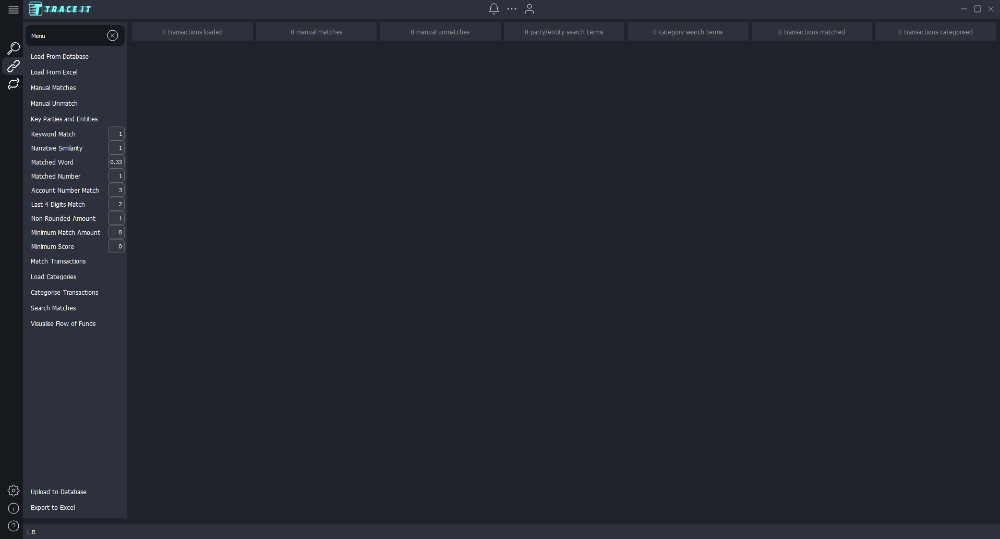

Transaction data can be imported from a SQL Server database or an Excel file. Note that all transactions must be consolidated in a single table or file for processing. While creating a master transaction table, including unique Transaction IDs, is outside the scope of this application, it can be easily accomplished through basic data processing and cleaning techniques.

Once loaded, the transactions will be displayed in a clear and organised table within the main content container, ready for further analysis and manipulation.

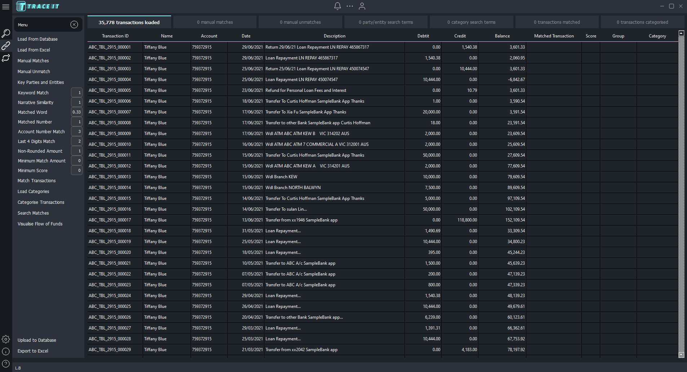

Configure input data with ease using popup windows, which allow you to:
* Input Manual Matches and Unmatches
* Reference Key Parties and Entities and related Search Terms
* Define Categories and related Search Terms

These popup windows offer flexible data entry options, enabling you to either manually input data or conveniently load it from a CSV or XLSX file.

<table>
  <tr>
    <td>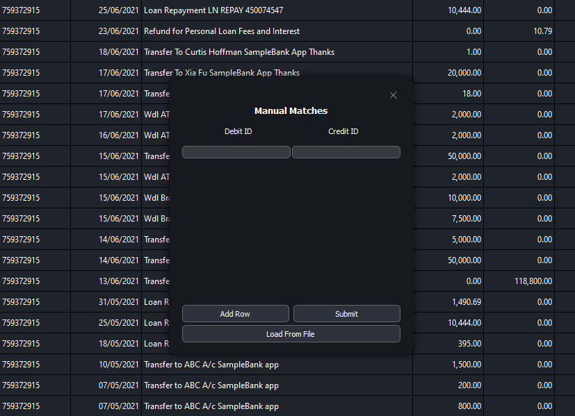</td>
    <td>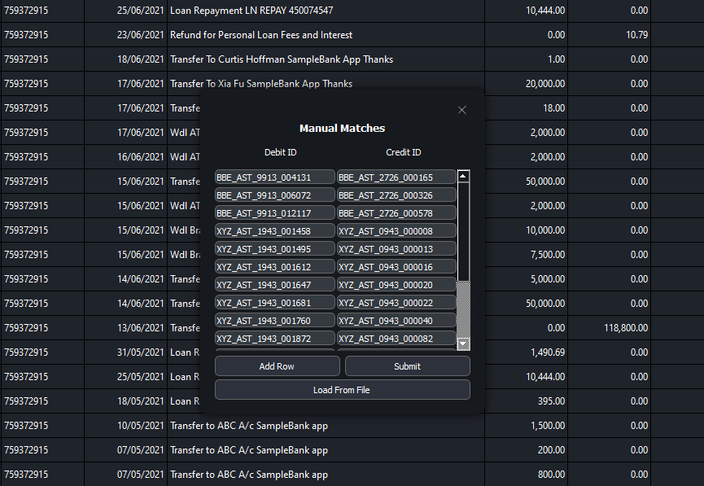</td>
  </tr>
</table>

As you load additional data and reference tables, the banner dynamically updates to display the number of records for each input table, providing a clear overview of your data.
Refine your match parameters using the match ribbon, then click the 'Match Transactions' button to execute the matching process. The transaction table will update with the following fields:
* Matched Transaction: The ID of the matched transaction
* Score: The match score between debit and credit
* Group: A unique identifier for each match group (1 debit and 1 credit per group)

To categorize transactions based on your custom Categories reference table, simply click the 'Categorise Transactions' button. The 'Category' field will be populated in the transaction table.

The match interface will then resemble the screenshot below, providing a visual representation of your matched and categorized transactions.

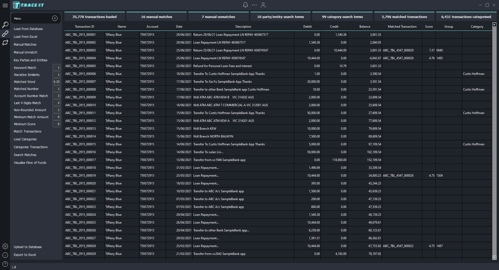

TraceIt enables users to efficiently navigate and refine the results of automated matching and categorization. With intuitive features, users can:
1. Rapidly search and filter data to focus on specific transactions
1. Organize results by sorting on key fields
1. Easily correct false positives by right-clicking on match groups and selecting 'Add to Unmatch List'
1. Manually assign or override transaction categories by double-clicking cells and entering text, or copying and pasting from other cells. 

<table>
  <tr>
    <td>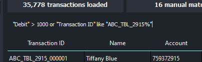</td>
  </tr>
</table>

<table>
  <tr>
    <td>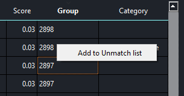</td>
    <td>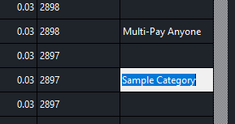</td>
  </tr>
</table>

Gain a comprehensive understanding of the flow of funds within the population by clicking the 'Visualise Flow of Funds' button. This interactive chord diagram provides a dynamic visualisation of the financial flows, with chords colored by key party/entity name. The ribbons represent the aggregate sums of money exchanged between accounts, and hovering over them with your cursor reveals the total amount of funds transferred between each account pair, based on the matched transactions.

<table>
  <tr>
    <td>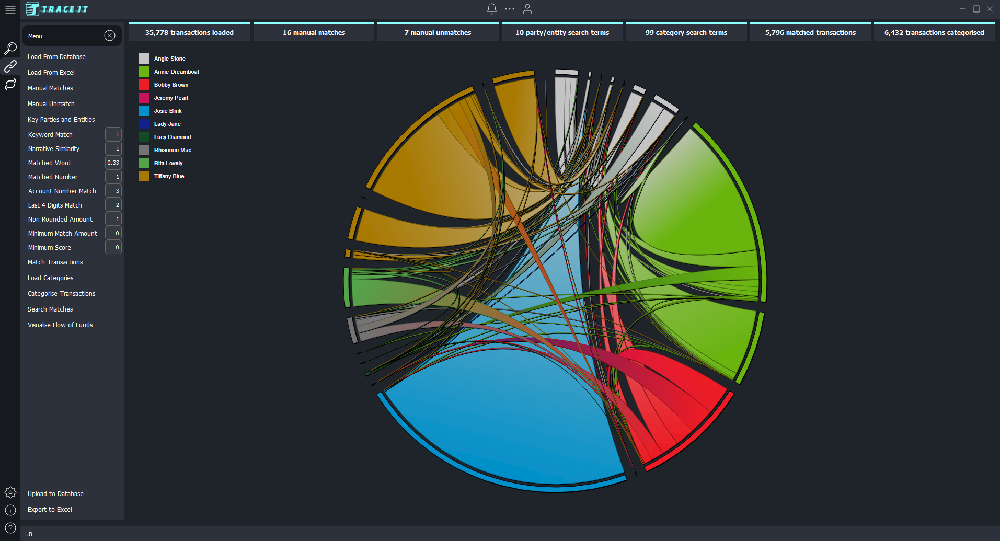</td>
    <td>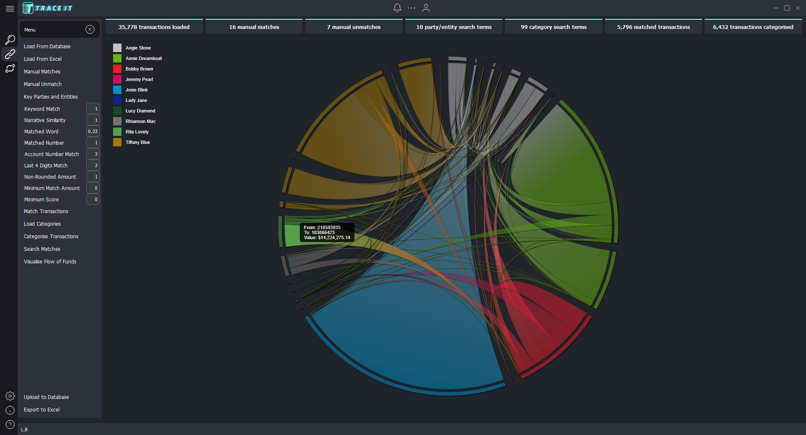</td>
  </tr>
</table>

## **Tracing** 

To begin tracing:
1. Access the tracing interface by clicking the magnifying glass icon in the top left corner.
1. Define your starting points by clicking 'Starting Transactions' and either manually entering or loading transactions from a file.
1. Select your preferred tracing methodology by clicking on its name.
1. Launch the tracing process by clicking 'Run Tracing'."

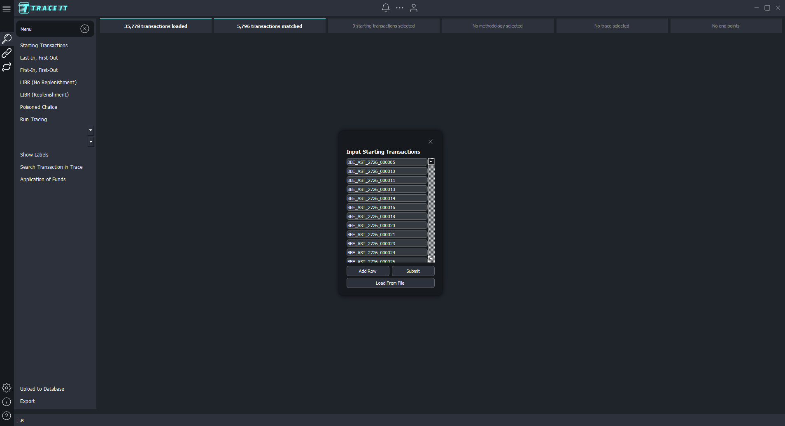

Upon completion of the tracing process, the main content container will display a visual representation of the trace, featuring a tree graph overlaying detailed transaction data. The tree graph illustrates the journey of a selected starting transaction, as determined by the chosen methodology. The transaction data provides a detailed breakdown of the methodology's application, showcasing transactions from one account at a time, with fields like 'Tainted Balance', 'Priority Balance', and 'Tainted Funds Used', making it easy to follow the automated calculations.
The trace visualization begins at the root node (starting transaction). The current position in the trace is indicated by the yellow node on the graph. Users can seamlessly navigate through the trace by:
* Double-clicking a node to reveal associated transactions
* Double-clicking a 'Matched Transaction' in the transaction data to traverse through the statements

As the user progresses through the trace path, the yellow node will dynamically update to reflect their current position.

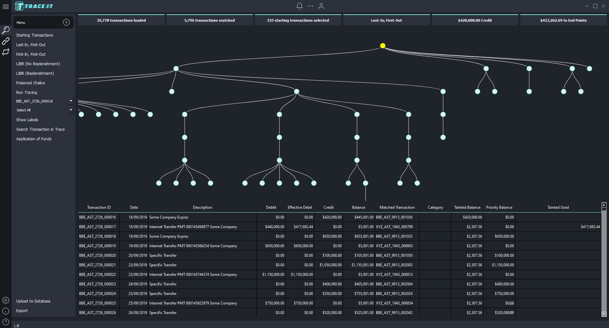

Additionally, users can:
* Scale the tree graph up or down with intuitive zoom controls
* Reposition the graph by dragging it across the screen
* Toggle the display of node labels on or off, as needed"

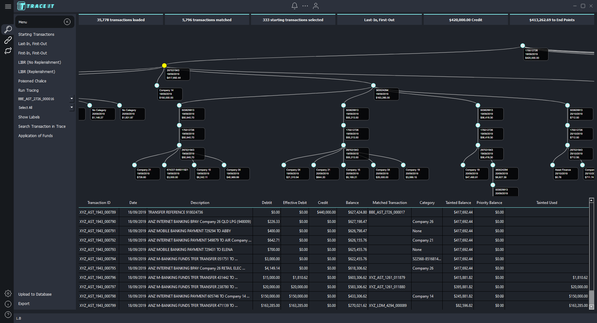

Users can further refine the graph by selecting specific categories from the dropdown menu, filtering the visualisation to only display paths leading to designated endpoints. In this example, we've filtered the graph to show only the paths leading to the following three identified accounts:
1. 674227-846011921
1. 619320-891517635
1. 218904-348011980

As the graph is filtered, the label in the top right corner updates dynamically, displaying the total amount of funds from the original starting transaction that were traced to these end destinations. In this case, the Last-In, First-Out methodology reveals that $6,140.12 out of the initial $420,000.00 transaction were paid to these three accounts.

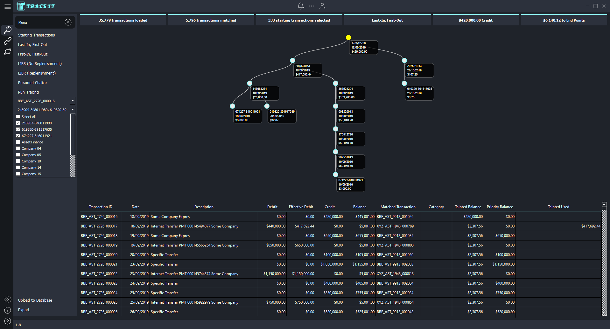

To gain a comprehensive overview of how tainted funds were ultimately utilised, users can click the 'Application of Funds' button, generating a dynamic Lollipop chart. This interactive visualisation displays the total value of tainted funds allocated to each category, with each category coloured proportionally to represent the percentage of funds contributed by each party.

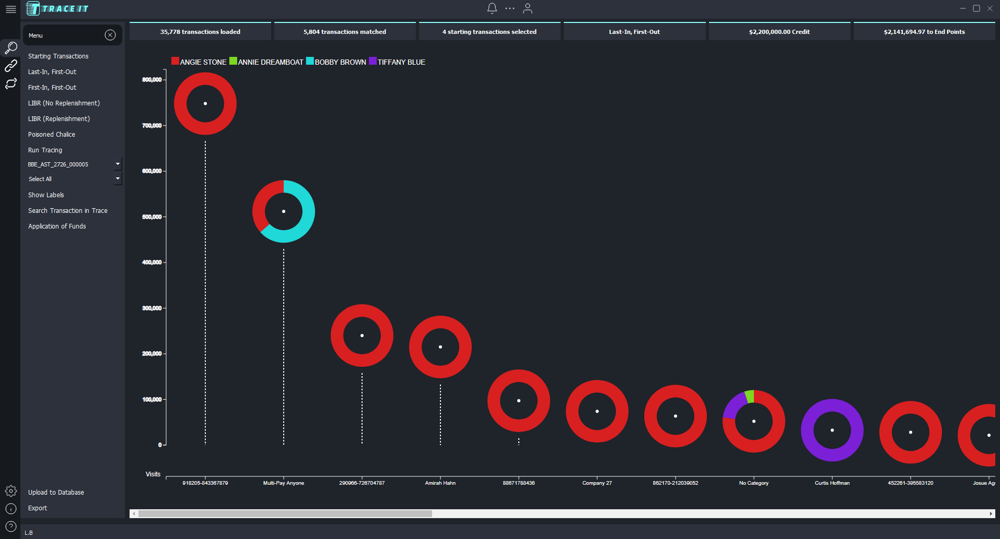